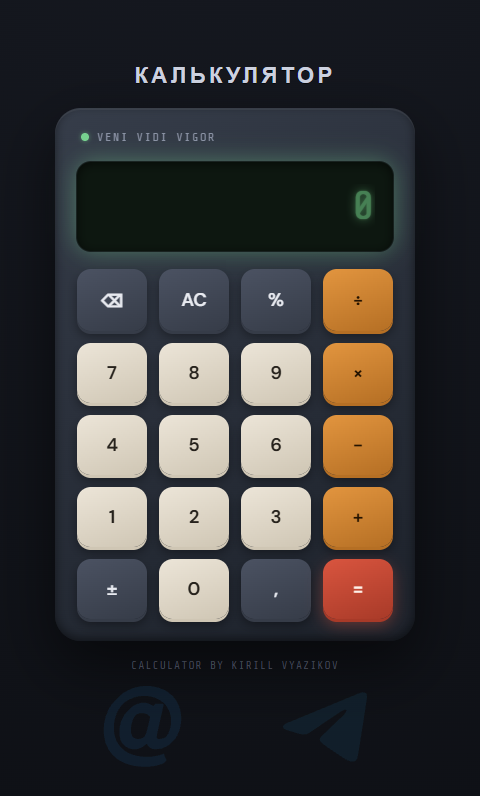

# Калькулятор

Простой калькулятор на чистом JavaScript (без фреймворков и библиотек). Учебный проект - сделан для практики работы с DOM, событиями и обработкой строк. Проект выполнен самостоятельно как pet-проект.

---

## Превью проекта


## Функциональность

- Базовые операции: сложение, вычитание, умножение, деление (`+`, `-`, `×`, `÷`)
- Ввод десятичных чисел через запятую (`,`)
- Смена знака числа (`±`) - с учётом отличия унарного минуса от бинарного
- Проценты (`%`) - с учётом контекста: после `+`/`-` считает процент от первого числа, после `×`/`÷` - просто делит на 100
- Очистка экрана (`AC`) и удаление последнего символа (`⌫`)
- Защита от некорректного ввода: нельзя поставить два оператора подряд, две запятые в одном числе и т.д.
- Обработка деления на ноль и синтаксических ошибок

## Технологии

- HTML
- CSS
- JavaScript (Vanilla, без библиотек)

## Как запустить

Проект не требует сборки или установки зависимостей - достаточно открыть `index.html` в браузере.

```bash
git clone <ссылка-на-репозиторий>
cd <папка-проекта>
```

Затем просто открыть `index.html` или через расширение вроде Live Server в VS Code.

## Известные ограничения

- Вычисления происходят через `eval()` - используется в данном проекте для обучения, в реальном проекте использовать небезопасно.
- Нет поддержки ввода с клавиатуры - только клик по кнопкам
- Не покрыты все возможные вариации с комбинацией `±` и `%` при многократных нажатиях подряд.

## Автор

**Kirill Vyazikov**

[](https://t.me/venividivigor)
[](mailto:VeniVidiVigorY@yandex.ru)